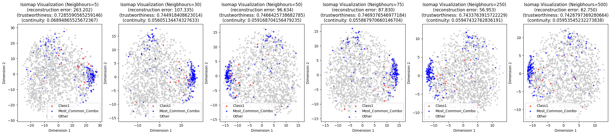
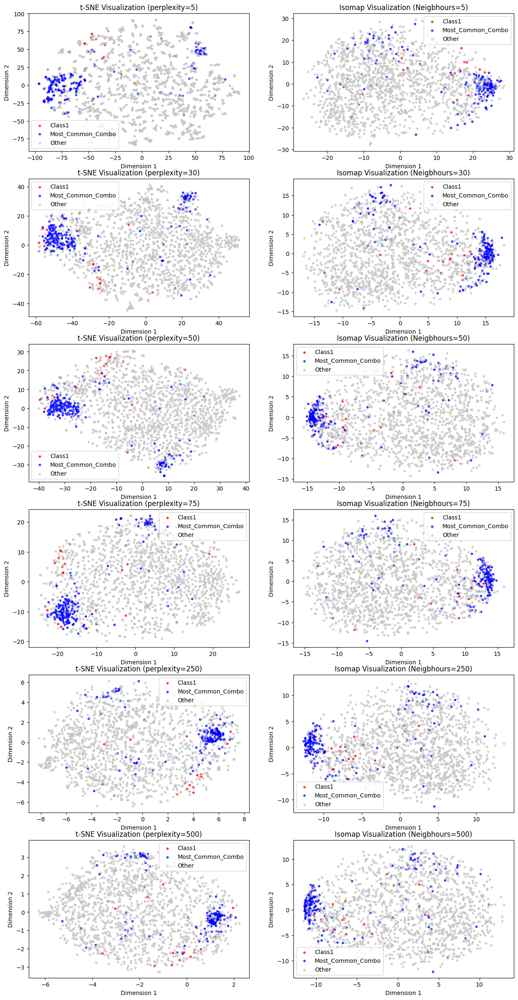
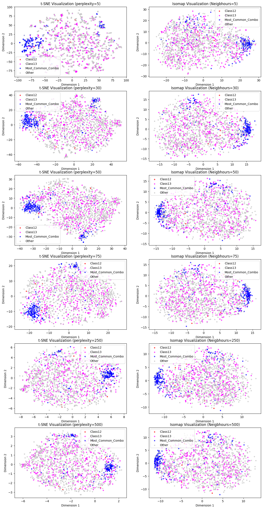

# Assignment 5 (Visualizing Data Veracity Challenges in Multi-Label Classification)

## Student Info:
Name: Shashank Satish Adsule\
Roll no.: DA25M005

## Dataset Used
- [**Yeast**](http://mulan.sourceforge.net/datasets-mlc.html)
- this data set contains 3 CSV files: 
    - `yeast.arff` [union of train and test data]
    - `yeast-train.arff`
    - `yeast-test.arff`
- The dataset contains 2417 smaples entries with 103 column feature, and 14 binary target variable:
    - Feature -> [Att1,...,Att103]
    - Classes -> [Class1,...,Class14]


## Objective
To visualize the intrinsic manifold structure of high-dimensional yeast data using:
1. **t-SNE (t-Distributed Stochastic Neighbor Embedding)**
2. **Isomap (Isometric Mapping)**

and to analyze:
- How local and global structures are preserved.
- The effect of hyperparameters such as *perplexity* (t-SNE) and *neighbors* (Isomap).
- The trustworthiness, continuity, and reconstruction error metrics.

### Label Simplification
To make visualization interpretable:
- Selected **Class1** as the two most frequent single-label classes.
- Identified the most frequent **multi-label combination** ["**Class3**","**Class4**","**Class12**","**Class13**"].
- Grouped all other labels under a new category **“Other”**.
- This reduced label complexity from 14 → 3 categories.

## Observations
> [!Note]\
>here i have create 2 version of same code where i **version 1** i'm checking for Most frequent single-label which is [**"CLass1"**] and Version 2 for Most frequent label (grouped) which are [**"Class12"** and **"Class13"**]. formation of cluster changes for both version which is shown in image below

| Method | Key Insight | Local Preservation | Global Preservation |
|:--------|:-------------|:------------------:|:-------------------:|
| **t-SNE** | Preserves local neighborhoods | High | Low |
| **Isomap** | Preserves manifold geometry | Moderate | High |

- for T-SNE **Perplexity = 50** gave the best visualization balance between local and global structures.


- for Isomap Found that reconstruction error decreased and stabilized around **neighbors = 50**, suggesting optimal manifold unfolding.




### comparision on diffrent version (both T-SNE and Isomap)
|Version 1|Version 2|
|:-:|:-:|
|||


## Python Dependencies
The following libraries were used in the analysis:

```bash
os                  # file path handling and system operations
pandas              # data manipulation and analysis
numpy               # numerical operations and array handling
matplotlib          # data visualization
scipy               # statistical operations and .arff file handling
    ├── io (arff)   # loading ARFF dataset
    └── stats (zscore)  # outlier detection using Z-distribution
scikit-learn        # machine learning utilities and manifold learning
    ├── preprocessing (StandardScaler)   # feature scaling
    ├── decomposition (PCA)              # initial dimensionality reduction
    ├── manifold (TSNE, Isomap)          # nonlinear manifold visualization
    └── metrics (pairwise_distances, trustworthiness)  # performance metrics
```
<!-- # ├── and └── -->

## Conclusion

- The yeast dataset lies on a **highly curved, nonlinear manifold**.  
- **t-SNE (perplexity = 50)** produced the clearest, most interpretable local clusters.  
- **Isomap (neighbors = 50)** best captured the global shape with low reconstruction error.  
- Both methods complement each other:
  - t-SNE → local exploration  
  - Isomap → global structure  
- The dataset’s curvature and overlapping labels explain why simple linear classifiers would struggle — nonlinear methods like SVM or neural networks would perform better.

<!--  -->
<!-- sumbit -> https://docs.google.com/forms/d/e/1FAIpQLSdVjS9pQtAX2VWVaO1180RSmsPGGDiXzurlmjmp1axFdF7jxQ/viewform -->
